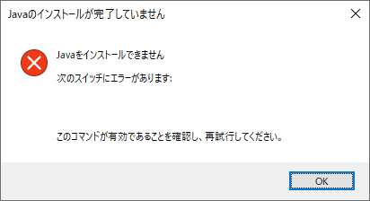
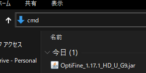
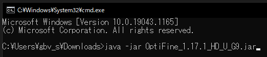
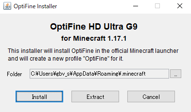

# Optifine Install Java Error

## 問題



ダウンロードしてきた Optifine の Jar ファイルをクリックしても以上のようなエラーがでる

## 解決方法

### 1. コマンドプロンプトを開く



画像の場所に `cmd` と入力し、エンターで実行する。黒い画面が出る。

### 2. `java -jar` コマンドを実行



```shell
java -jar ダウンロードしたOptifineのファイル名
```

と言うコマンドを入力し、エンターで実行する。

### 3. インストール



`Install` というボタンを押す。インストールできたら Minecraft ランチャーから Optifine を選択する。
